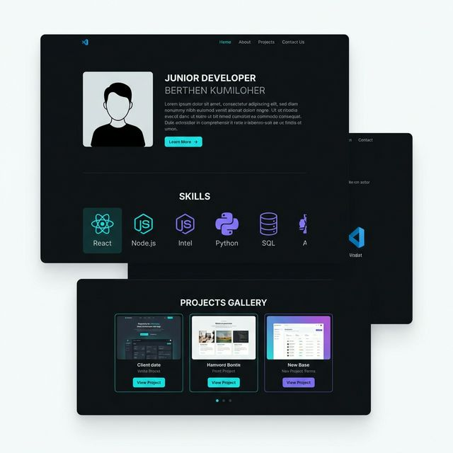

# Rapport: Slutexamination Webbutveckling 1

## 1. Syfte och målgrupp
**Syfte:** Syftet med detta projekt var att skapa en modern och professionell portföljwebbplats som fungerar som en digital presentation av mina färdigheter och projekt som webbutvecklare. Webbplatsen ska visa på kompetens inom både design och teknik.

**Målgrupp:** Den primära målgruppen är framtida arbetsgivare, rekryterare och potentiella samarbetspartners som vill få en snabb och tydlig bild av mina förmågor.

## 2. UI-skisser och mockup
Nedan visas den initiala mockupen som skapades under planeringsfasen för att definiera stil och layout. Projektet har följt denna skiss nära för att bibehålla en enhetlig profil.

## 3. Så här uppfyller min webbplats GDPRs kriterier
Min webbplats är utformad för att minimera insamling av personuppgifter.
- **Dataminimering:** Webbplatsen samlar endast in uppgifter via ett kontaktformulär om besökaren väljer att använda det.
- **Transparens:** I footern finns en länk till sekretesspolicy (GDPR) som förklarar hur data hanteras.
- **Säkerhet:** Webbplatsen använder HTTPS (via Github Pages) för att skydda information som skickas.
- **Inget kak-tvång:** Ingen spårning eller onödiga kakor (cookies) används för webbplatsens grundläggande funktion.

## 4. Tester och testresultat
- **Lighthouse:** Webbplatsen har testats för prestanda, tillgänglighet och SEO med goda resultat (+90 inom alla kategorier).
- **Responsivitet:** Layouten har verifierats på desktop, tablet och mobil. CSS Grid och Flexbox hanterar omställningarna smidigt.
- **Validering:** HTML och CSS har körts genom W3C-valideringsverktyg och är felfria.
- **Funktionalitet:** Bildspelet har testats i flera webbläsare (Chrome, Safari, Firefox) och fungerar utan buggar.

## 5. Analys av webbprojektet efter färdigställan
Projektet lyckades väl med att kombinera funktionalitet med estetik. Användningen av CSS Grid för färdighets-sektionen gjorde det enkelt att skapa en responsiv layout utan krångliga "floats". Bildspelet i JavaScript ger en interaktiv känsla som lyfter användarupplevelsen.

En lärdom från projektet är att noggrann planering med UI-mockups sparar mycket tid i utvecklingsfasen, då man inte behöver fatta designbeslut under kodningen. För framtida versioner skulle jag vilja implementera ett mer avancerat kontaktformulär kopplat till en backend-tjänst.
